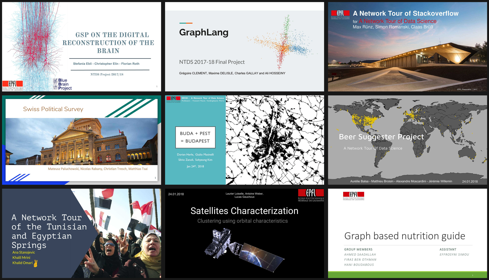

# A Network Tour of Data Science, edition 2017

[][binder_lab]
&nbsp; (Jupyter [lab][binder_lab] or [notebook][binder_notebook])

[binder_lab]: https://mybinder.org/v2/gh/mdeff/ntds_2017/outputs?urlpath=lab
[binder_notebook]: https://mybinder.org/v2/gh/mdeff/ntds_2017/outputs?urlpath=tree

This repository contains the material for the practical work associated with the EPFL
master course [EE-558 A Network Tour of Data Science][epfl] ([moodle]), taught
in fall 2017. Compared to the [2016 edition], the course has been refocused
on graph and network sciences. It is further developed in the [2018 edition].
The course material revolves around the following topics:

1. [Network Science](https://en.wikipedia.org/wiki/Network_science),
1. [Spectral Graph Theory](https://en.wikipedia.org/wiki/Spectral_graph_theory),
1. [Graph Signal Processing](https://arxiv.org/abs/1211.0053),
1. [Data Science](https://en.wikipedia.org/wiki/Data_science),
1. [Machine Learning](https://en.wikipedia.org/wiki/Machine_learning).

Theoretical knowledge is taught during lectures.
Practical knowledge is taught through [tutorials](#tutorials).
Both are practiced and evaluated through [four assignments](#assignments) and a [semester project](#projects).
Below are slides about the organization of the course.

1. [Practical information][practical_info]
1. [Projects][projects]
1. [Concluding remarks][conclusion]

[epfl]: http://edu.epfl.ch/coursebook/en/a-network-tour-of-data-science-EE-558
[moodle]: http://moodle.epfl.ch/course/view.php?id=15299
[2016 edition]: https://github.com/mdeff/ntds_2016
[2018 edition]: https://github.com/mdeff/ntds_2018

[practical_info]: https://github.com/mdeff/ntds_2017/blob/outputs/slides/ntds_labs.pdf
[projects]: https://github.com/mdeff/ntds_2017/blob/outputs/slides/ntds_projects.pdf
[conclusion]: https://github.com/mdeff/ntds_2017/blob/outputs/slides/ntds_conclusion.pdf

## Tutorials

Below is the teaching material you'll find in this repository.

1. [Installation instructions](#installation)
1. [Introduction][d01]: conda & Anaconda, Python, Jupyter, git, scientific Python
1. [Data acquisition from Twitter][d02]
1. [Numerical computing with numpy][d03]
1. [Network models and properties with networkx][d04]
1. [Plotting with matplotlib][d05]
1. [Web APIs and data analysis with pandas][d06]
1. [Data exploration and visualization][d07]
1. [Graph signal processing with the PyGSP][d08]

[d01]: https://nbviewer.jupyter.org/github/mdeff/ntds_2017/blob/outputs/demos/01_introduction.ipynb
[d02]: https://nbviewer.jupyter.org/github/mdeff/ntds_2017/blob/outputs/demos/02_data_acquisition_twitter.ipynb
[d03]: https://nbviewer.jupyter.org/github/mdeff/ntds_2017/blob/outputs/demos/03_numpy.ipynb
[d04]: https://nbviewer.jupyter.org/github/mdeff/ntds_2017/blob/outputs/demos/04_networkx.ipynb
[d05]: https://nbviewer.jupyter.org/github/mdeff/ntds_2017/blob/outputs/demos/05_matplotlib.ipynb
[d06]: https://nbviewer.jupyter.org/github/mdeff/ntds_2017/blob/outputs/demos/06_webapi_pandas.ipynb
[d07]: https://nbviewer.jupyter.org/github/mdeff/ntds_2017/blob/outputs/demos/07_data_exploration_and_visualisation.ipynb
[d08]: https://nbviewer.jupyter.org/github/mdeff/ntds_2017/blob/outputs/demos/08_pygsp.ipynb

## Assignments

The following assignments were designed to evaluate the theoretical understanding of students through practice.
As a Data Science course, those activities are realized on real data and networks.

1. Network properties: [assignment][a01], [solution][a01s1], [student solution][a01s2], [feedback][a01fb]
1. Network models: [assignment][a02], [solution][a02s]
1. Spectral graph theory: [assignment][a03], [solution][a03s], [feedback][a03fb]
1. Graph signal processing: [assignment][a04], [solution][a04s], [feedback][a04fb]

[a01]: https://nbviewer.jupyter.org/github/mdeff/ntds_2017/blob/outputs/assignments/01_network_properties.ipynb
[a01s1]: https://nbviewer.jupyter.org/github/mdeff/ntds_2017/blob/outputs/assignments/01_solution_ersi.ipynb
[a01s2]: https://nbviewer.jupyter.org/github/mdeff/ntds_2017/blob/outputs/assignments/01_solution_florian.ipynb
[a01fb]: https://nbviewer.jupyter.org/github/mdeff/ntds_2017/blob/outputs/assignments/01_feedback.ipynb
[a02]: https://nbviewer.jupyter.org/github/mdeff/ntds_2017/blob/outputs/assignments/02_network_models.ipynb
[a02s]: https://nbviewer.jupyter.org/github/mdeff/ntds_2017/blob/outputs/assignments/02_solution.ipynb
[a03]: https://nbviewer.jupyter.org/github/mdeff/ntds_2017/blob/outputs/assignments/03_spectral_graph_theory.ipynb
[a03s]: https://nbviewer.jupyter.org/github/mdeff/ntds_2017/blob/outputs/assignments/03_solution.ipynb
[a03fb]: https://nbviewer.jupyter.org/github/mdeff/ntds_2017/blob/outputs/assignments/03_feedback.ipynb
[a04]: https://nbviewer.jupyter.org/github/mdeff/ntds_2017/blob/outputs/assignments/04_graph_signal_processing.ipynb
[a04s]: https://nbviewer.jupyter.org/github/mdeff/ntds_2017/blob/outputs/assignments/04_solution.ipynb
[a04fb]: https://nbviewer.jupyter.org/github/mdeff/ntds_2017/blob/outputs/assignments/04_feedback.ipynb

## Projects

Part of the course is evaluated by an open-ended project (see the [description][projects]),
proposed and carried out by groups of three to four students.
Below is the work of the 107 students enrolled that year.

* [[proposal][01p], [analysis][01r], [slides][01s]] American Basketball Players
* [[proposal][02p], [analysis][02r], [slides][02s]] Graph-based Nutrition Guide
* [[proposal][03p], [analysis][03r], [slides][03s]] What Impacts the Success of a Movie?
* [[proposal][04p], [analysis][04r], [slides][04s]] Exploring the Crunchbase Dataset to Detect High Potential Startups
* [[proposal][05p], [analysis][05r], [slides][05s]] Beer Suggester
* [[proposal][06p], [analysis][06r], [slides][06s]] Swiss Political Survey
* [[proposal][07p], [analysis][07r], [slides][07s]] A StackOverflow Recommender System
* [[proposal][08p], [analysis][08r], [slides][08s]] Analysis of World Development Indicators as Predictors
* [[proposal][09p], [analysis][09r], [slides][09s]] Satellites Characterization – Clustering using Orbital Characteristics
* [[proposal][10p], [analysis][10r], [slides][10s]] Amazon Electronic Products – Network Analysis
* [[proposal][11p], [analysis][11r], [slides][11s]] GSP on the Digital Reconstruction of the Brain
* [[proposal][12p], [analysis][12r], [slides][12s]] Movie Recommendation
* [[proposal][13p], [analysis][13r], [slides][13s]] GraphLang
* [[proposal][14p], [analysis][14r], [slides][14s]] Buda + Pest = Budapest
* [[proposal][15p], [analysis][15r], [slides][15s]] Manifold Learning of Face Data
* [[proposal][16p], [analysis][16r], [slides][16s]] A Network Tour of the Tunisian and Egyptian Springs
* [[proposal][17p], [analysis][17r], [slides][17s]] StackOverflow Survey
* [[proposal][18p], [analysis][18r], [slides][18s]] Speech Recognition Challenge
* [[proposal][19p], [analysis][19r], [slides][19s]] Analysis of the Elite Football Transfer Market
* [[proposal][20p], [analysis][20r], [slides][20s]] Titanic
* [[proposal][21p], [analysis][21r], [slides][21s]] This is My Jam
* [[proposal][22p], [analysis][22r], [slides][22s]] A Network Tour of StackOverflow
* [[proposal][23p], [analysis][23r], [slides][23s]] Course Suggester
* [[proposal][24p], [analysis][24r], [slides][24s]] Spectral Analysis of 5000 Movies Network
* [[proposal][25p], [analysis][25r], [slides][25s]] Community Detection on the Wikipedia Hyperlink Graph
* [[proposal][26p], [analysis][26r], [slides][26s]] 3D Meshes of Facial Expression
* [[proposal][27p], [analysis][27r], [slides][27s]] Terrorist Attacks
* [[proposal][28p], [analysis][28r], [slides][28s]] Community Detection and Labelling in an Instagram Network
* [[proposal][29p], [analysis][29r], [slides][29s]] Graph-based Recommendation for lastFM

[01p]: projects/proposals/basketball_players.pdf
[02p]: projects/proposals/nutrition_guide.pdf
[03p]: projects/proposals/movie_success.pdf
[04p]: projects/proposals/crunchbase_startups.pdf
[05p]: projects/proposals/beer_suggester.pdf
[06p]: projects/proposals/swiss_politics.pdf
[07p]: projects/proposals/stackoverflow_recommendation.pdf
[08p]: projects/proposals/countries_development.pdf
[09p]: projects/proposals/satellites.pdf
[10p]: projects/proposals/amazon_products.pdf
[11p]: projects/proposals/brain_network.pdf
[12p]: projects/proposals/movie_recommendation.pdf
[13p]: projects/proposals/graphlang.pdf
[14p]: projects/proposals/road_network.pdf
[15p]: projects/proposals/face_manifold.pdf
[16p]: projects/proposals/arab_springs.pdf
[17p]: projects/proposals/stackoverflow_survey.pdf
[18p]: projects/proposals/speech_recognition.pdf
[19p]: projects/proposals/football_transfers.pdf
[20p]: projects/proposals/titanic.pdf
[21p]: projects/proposals/jam.pdf
[22p]: projects/proposals/stackoverflow_network.pdf
[23p]: projects/proposals/course_suggester.pdf
[24p]: projects/proposals/movie_network.pdf
[25p]: projects/proposals/wikipedia_hyperlink.pdf
[26p]: projects/proposals/facial_expression.pdf
[27p]: projects/proposals/terrorist_attacks.pdf
[28p]: projects/proposals/instagram_community.pdf
[29p]: projects/proposals/lastfm_recommendation.pdf

[01s]: projects/slides/basketball_players.pdf
[02s]: projects/slides/nutrition_guide.pdf
[03s]: projects/slides/movie_success.pdf
[04s]: projects/slides/crunchbase_startups.pdf
[05s]: projects/slides/beer_suggester.pdf
[06s]: projects/slides/swiss_politics.pdf
[07s]: projects/slides/stackoverflow_recommendation.pdf
[08s]: projects/slides/countries_development.pdf
[09s]: projects/slides/satellites.pdf
[10s]: projects/slides/amazon_products.pdf
[11s]: projects/slides/brain_network.pdf
[12s]: projects/slides/movie_recommendation.pdf
[13s]: projects/slides/graphlang.pdf
[14s]: projects/slides/road_network.pdf
[15s]: projects/slides/face_manifold.pdf
[16s]: projects/slides/arab_springs.pdf
[17s]: projects/slides/stackoverflow_survey.pdf
[18s]: projects/slides/speech_recognition.pdf
[19s]: projects/slides/football_transfers.pdf
[20s]: projects/slides/titanic.pdf
[21s]: projects/slides/jam.pdf
[22s]: projects/slides/stackoverflow_network.pdf
[23s]: projects/slides/course_suggester.pdf
[24s]: projects/slides/movie_network.pdf
[25s]: projects/slides/wikipedia_hyperlink.pdf
[26s]: projects/slides/facial_expression.pdf
[27s]: projects/slides/terrorist_attacks.pdf
[28s]: projects/slides/instagram_community.pdf
[29s]: projects/slides/lastfm_recommendation.pdf

[01r]: projects/reports/basketball_players
[02r]: projects/reports/nutrition_guide
[03r]: projects/reports/movie_success
[04r]: projects/reports/crunchbase_startups
[05r]: projects/reports/beer_suggester
[06r]: projects/reports/swiss_politics
[07r]: projects/reports/stackoverflow_recommendation
[08r]: projects/reports/countries_development
[09r]: projects/reports/satellites
[10r]: projects/reports/amazon_products
[11r]: projects/reports/brain_network
[12r]: projects/reports/movie_recommendation
[13r]: projects/reports/graphlang
[14r]: projects/reports/road_network
[15r]: projects/reports/face_manifold
[16r]: projects/reports/arab_springs
[17r]: projects/reports/stackoverflow_survey
[18r]: projects/reports/speech_recognition
[19r]: projects/reports/football_transfers
[20r]: https://github.com/zifeo/Titanic
[21r]: projects/reports/jam
[22r]: projects/reports/stackoverflow_network
[23r]: projects/reports/course_suggester
[24r]: projects/reports/movie_network
[25r]: projects/reports/wikipedia_hyperlink
[26r]: projects/reports/facial_expression
[27r]: projects/reports/terrorist_attacks
[28r]: projects/reports/instagram_community
[29r]: projects/reports/lastfm_recommendation

## Installation

Click the [binder badge][binder_lab] to play with the notebooks from your
browser without installing anything.

For a local installation, you will need [git], [Python], and packages from the
[Python scientific stack][scipy]. If you don't know how to install those on
your platform, we recommend to install [Miniconda], a distribution of the
[conda] package and environment manager. Please follow the below instructions
to install it and create an environment for the course.

1. Download the Python 3.x installer for Windows, macOS, or Linux from
   <https://conda.io/miniconda.html> and install with default settings. Skip
   this step if you have conda already installed (from [Miniconda] or
   [Anaconda]). Linux users may prefer to use their package manager.
   * Windows: Double-click on the `.exe` file.
   * macOS: Run `bash Miniconda3-latest-MacOSX-x86_64.sh` in your terminal.
   * Linux: Run `bash Miniconda3-latest-Linux-x86_64.sh` in your terminal.
1. Open a terminal. Windows: open the Anaconda Prompt from the Start menu.
1. Install git with `conda install git`.
1. Download this repository by running
   `git clone --recurse-submodules https://github.com/mdeff/ntds_2017`.
1. Create an environment with the packages required for the course with
   `conda env create -f ntds_2017/environment.yml`.

Every time you want to work, do the following:

1. Open a terminal. Windows: open the Anaconda Prompt from the Start menu.
1. Activate the environment with `conda activate ntds_2017`
   (or `activate ntds_2017`, or `source activate ntds_2017`).
1. Start Jupyter with `jupyter notebook` or `jupyter lab`. The command should
   open a new tab in your web browser.
1. Edit and run the notebooks from your browser.

[git]: https://git-scm.com
[python]: https://www.python.org
[scipy]: https://www.scipy.org
[anaconda]: https://anaconda.org
[miniconda]: https://conda.io/miniconda.html
[conda]: https://conda.io
[conda-forge]: https://conda-forge.org

## Team

* Instructors:
[Pierre Vandergheynst](https://people.epfl.ch/pierre.vandergheynst),
[Pascal Frossard](https://people.epfl.ch/pascal.frossard).
* Assistants:
[Michaël Defferrard](http://deff.ch),
[Hermina Petric Maretic](https://people.epfl.ch/hermina.petricmaretic),
[Effrosyni Simou](https://people.epfl.ch/effrosyni.simou).
* Invited lecturers:
[Igor Perisic](https://www.linkedin.com/in/igorperisic),
[Kirell Benzi](https://www.kirellbenzi.com),
[Dorina Thanou](https://people.epfl.ch/dorina.thanou),
[Michaël Defferrard](http://deff.ch).

## License

The content is released under the terms of the [MIT License](LICENSE.txt).
