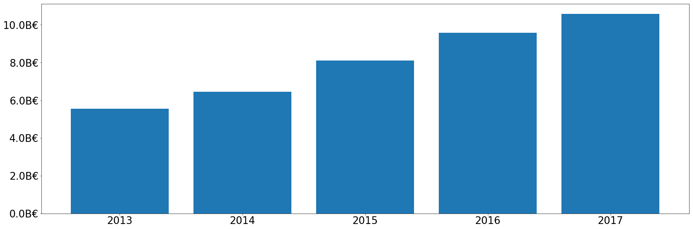
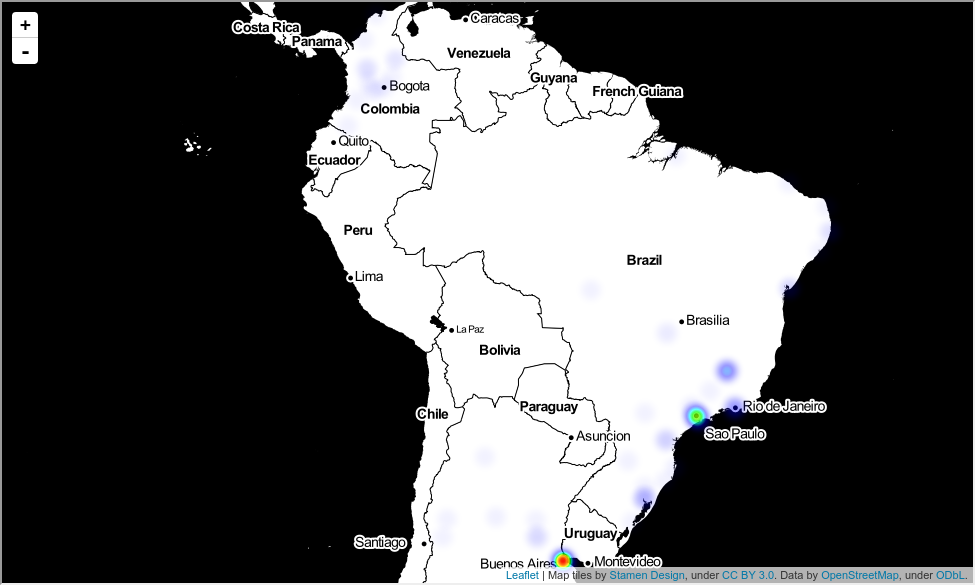
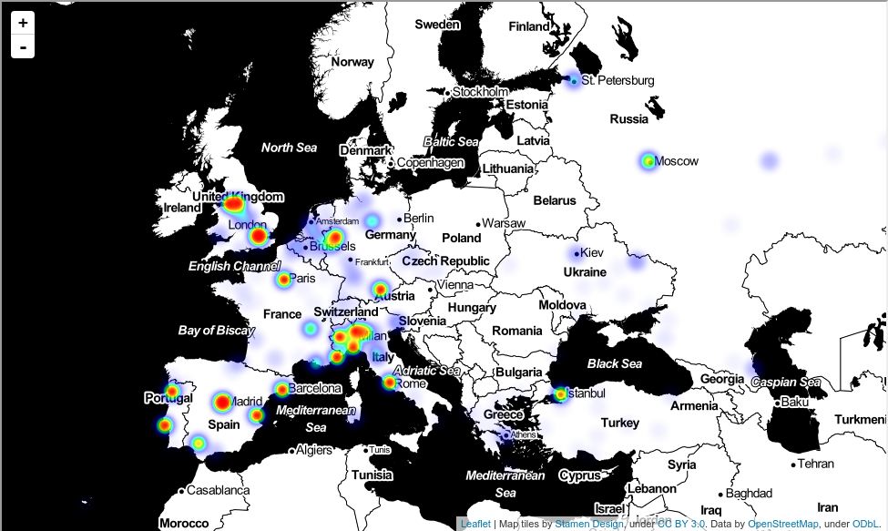
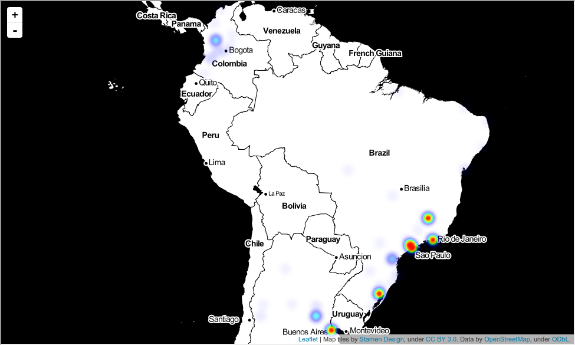
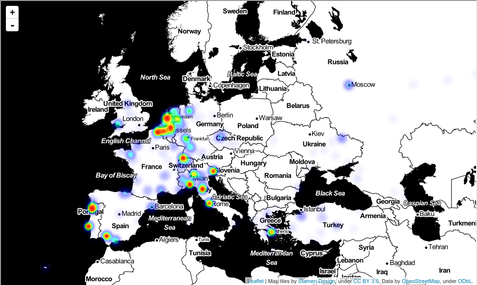
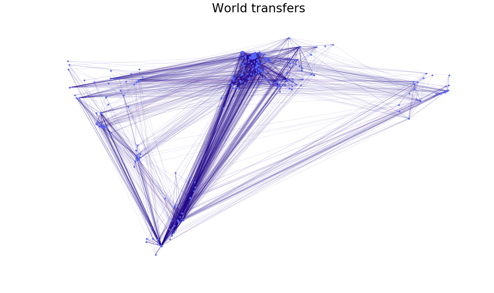

# NTDS - Elite Football Transfers Analysis

Nathan Quinteiro
Fayez Mourad
George Abi-Younes
[Github Repo](https://github.com/nathanquinteiro/ntds_football_transfer)

This project aims at analyzing of the fooball transfers in today's elite football.

We have gathered the data about the top football leagues in Europe, South and North America and Asia, all leagues which has a total estimated market values for their players exceeding **200 Millions euros**.

For this leagues, we have the data about the clubs (name, location, players, total values of the players) and all the players (name, club, birthdate, list of transfers, etc...).

We then used the data to analyze the transfer patterns, geographically and according to clubs wealth, and we also analyzed the evolution of the transfers market over the last 5 years.

    
    
Figure 1: Total money spent on football transfers between elite clubs

The figure 2 is a heatmap representing where the money is spent on the market transfer, in Europe and South America

    
    
    
Figure 2: Heatmap of money spent in transfers by clubs - S. America and Europe

We can observe, as all football amateur would expect, that the big European leagues (England, Spain, Germany and Italy) are well represented in red on this map.

The figure 3 is a heatmap representing where the benefits is made on the market transfer, in Europe and South America

    
    
    
Figure 3: Heatmap of benefits made in transfers by clubs - S. America and Europe

We clearly see on the map that the clubs that make profits and those who spend the most money are not the same. 

Cities in Europe with big clubs like London (Chelsea, Arsenal, Tottenham), Manchester (City and United), Barcelona, Madrid (Real and Atletico), Paris (PSG), Milano (AC and Inter), Torino (Juventus) and Munich (Bayern) are not visible anmore. 

We also notice that South America is way more visible on the benefits heatmap, compared to the spending one, confirming the intuition that South American clubs tends to seel there best players to European clubs.

## World interactions

Figure 4 shows the interactions between the clubs, using the transfer as edges and clubs as nodes with their latitude and logitude as coordinates. The transfer amount influence the color of the edges, darker edges indicates larger transfer fees.

    
    
Figure 4: Weighted and located world transfers graph

 

We observe that transfer between European clubs(top center), and South American clubs (bottom left) represents the biggest intercontinental market.